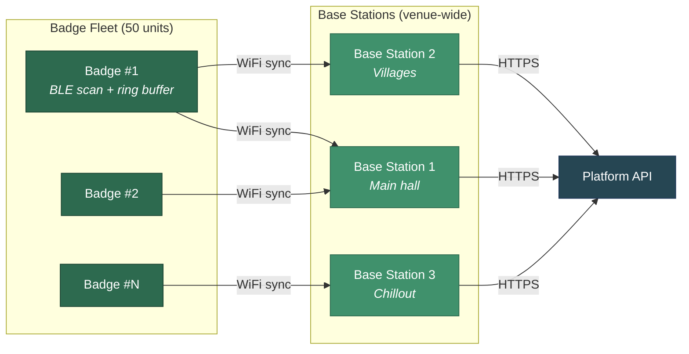

# ble-badge-sao

**ESP32-C3 BLE scanning badge** — a conference SAO that passively discovers Bluetooth devices, stores observations locally, and syncs to base stations for live analysis.

Built for the [bluetooth-warwalking](https://github.com/mattmiller/bluetooth-warwalking) platform, where every BLE device is a "species" and every badge wearer is an unwitting field researcher.

## What It Does



The badge scans BLE advertisements, extracts device info (MAC, RSSI, advertising data, timestamp), and writes observations into a circular flash buffer. When in range of a base station, it syncs its buffer over WiFi. The base station adds GPS coordinates and forwards everything to the platform API.

Every badge wearer becomes a data collector — which is itself the privacy point being demonstrated.

## DEFCON Deployment

**Target: 50 badges** distributed at DEFCON. Base stations placed around the venue. A live web dashboard shows the collective findings in real time.

## Badge Hardware Specs

| Spec | Target |
|---|---|
| MCU | ESP32-C3 (BLE 5.0, RISC-V, lowest power draw) |
| Form factor | SAO v1.69bis standard connector |
| Power | Host badge via SAO connector (no onboard battery) |
| Storage | ~2MB flash for observation ring buffer (~41K observations) |
| Antenna | PCB trace or ceramic chip — 10m effective range |
| LED | Min 1 for status (scanning/sync/error) |
| QR code | On-board, linking to results dashboard |
| BOM target | Under $15/unit at 50-unit batch |
| Durability | Survives 3 days of conference wear |

## Contributing

We're looking for help in two areas — hardware design and firmware. **You don't need custom hardware to start on firmware** — any ESP32-C3 dev board works.

### Hardware Design (Story 1.1)

Design the physical SAO badge — PCB schematic, component selection, and layout.

**Skills needed:** PCB/schematic design, ESP32 hardware experience, SAO standard familiarity

**Key decisions:**
- Antenna approach (PCB trace vs. ceramic chip)
- QR code method (silkscreen vs. sticker)
- LED placement and count
- Connector routing and mechanical durability
- Assembly method for 50-unit batch

### Firmware (Stories 1.2–1.4)

Implement the scanning and storage firmware. Develop on **any ESP32-C3 dev board** ($5-10) — no custom PCB needed.

| Story | Description | Key Details |
|---|---|---|
| 1.2 — BLE Scanning | Passive BLE scanner using NimBLE | Capture MAC (randomized-aware), RSSI, timestamp, raw advertising data. Track unique vs. repeat devices. |
| 1.3 — Ring Buffer Storage | Circular buffer in dedicated flash partition | ~41K observation capacity. Oldest-evicted-first when full. Power-loss safe writes. |
| 1.4 — Badge Identity & LED | Unique badge ID + status indicators | Short hex ID burned at flash time. LED patterns for scanning, sync, error states. 16-hour continuous operation. |

### Base Station (Epic 2)

Raspberry Pi that acts as a WiFi AP for badge sync, adds GPS coordinates, and forwards data to the platform. This comes after the badge firmware is working.

## Tech Stack

| Component | Technology |
|---|---|
| Badge firmware | C, ESP-IDF 5.5.x, NimBLE |
| Base station | Python, FastAPI (lightweight receiver) |
| Build system | CMake (ESP-IDF) |
| Flash tool | esptool.py |

## Repo Structure

```
ble-badge-sao/
  firmware/       # Badge SAO firmware (ESP-IDF + NimBLE)
  edge/           # Base station receiver service
  docs/           # Hardware design docs, schematics, BOM
```

## Getting Started

1. **Join the Discord** — link in the project description
2. **Grab an ESP32-C3 dev board** — Seeed XIAO ESP32-C3 or any ESP32-C3 devkit ($5-10)
3. **Set up ESP-IDF 5.5.x** — [Espressif docs](https://docs.espressif.com/projects/esp-idf/en/stable/esp32c3/get-started/)
4. **Check the issues** for tagged tasks

## Key Concepts

### Ring Buffer Storage

The badge stores observations in a circular buffer on flash. When storage fills up, the oldest entries get overwritten — no data loss panic, just a rolling window of the most recent ~41K observations.

```
┌──────────────────────────────────────┐
│  Flash Partition (~2MB)              │
│  ┌───┬───┬───┬───┬───┬───┬───┬───┐  │
│  │ 1 │ 2 │ 3 │ 4 │ 5 │ 6 │...│ N │  │
│  └───┴───┴───┴─▲─┴───┴───┴───┴───┘  │
│                │                     │
│            write_ptr                 │
│     (next write overwrites oldest)   │
└──────────────────────────────────────┘
```

Each observation is a fixed-size record: MAC address (6B), RSSI (1B), timestamp (4B), advertising data (up to 31B), plus metadata. When the write pointer wraps around, you're always looking at the freshest data.

### NimBLE (vs. Bluedroid)

We use **NimBLE**, the lightweight BLE stack for ESP-IDF, instead of the default Bluedroid. NimBLE uses ~50% less RAM, has a simpler API, and is better suited for a single-purpose scanner that needs to run for 16+ hours on limited resources.

### SAO v1.69bis

The [Shitty Add-On](https://hackaday.com/2019/03/20/introducing-the-shitty-add-on-v1-69bis-standard/) standard — a simple 2x3 pin connector that lets small PCBs attach to conference badges. Power comes from the host badge, so no onboard battery needed.

## Related

- **[bluetooth-warwalking](https://github.com/mattmiller/bluetooth-warwalking)** — the platform that ingests badge data, classifies BLE devices into "species," and powers the dashboard, life lists, and gamification

## License

TBD
