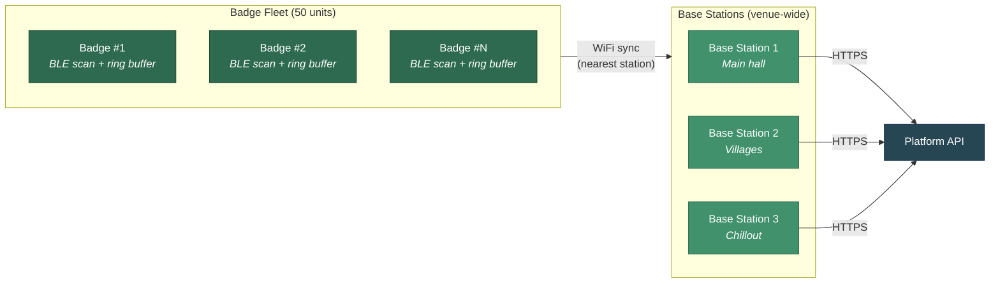

# ble-badge-sao

**ESP32-C3 BLE scanning badge** — a conference SAO that passively discovers Bluetooth devices, stores observations locally, and syncs to base stations for live analysis.

Part of a larger platform where every BLE device is a "species" and every badge wearer is an unwitting field researcher.

## What It Does



The badge scans BLE advertisements, extracts device info (MAC, RSSI, advertising data, timestamp), and writes observations into a circular flash buffer. When in range of a base station, it syncs its buffer over WiFi. The base station adds GPS coordinates and forwards everything to the platform API.

Every badge wearer becomes a data collector — which is itself the privacy point being demonstrated.

## DEFCON Deployment

**Target: 50 badges** distributed at DEFCON. Base stations placed around the venue. A live web dashboard shows the collective findings in real time.

## Project Checklist

### Identity & Design
- [ ] Badge name (working name: "ble-badge-sao" — open to ideas)
- [ ] Visual motif / theme (birding? surveillance? wildlife research? something else?)
- [ ] Brand elements for PCB silkscreen art
- [ ] QR code approach (silkscreen vs. sticker — affects replaceability)

### Hardware Design
- [ ] MCU selection finalized (currently proposing ESP32-C3)
- [ ] SAO v1.69bis connector routing
- [ ] Antenna approach (PCB trace vs. ceramic chip)
- [ ] LED count and placement
- [ ] Component selection and BOM
- [ ] PCB schematic and layout
- [ ] Assembly method for 50-unit batch
- [ ] Prototype build and test

### Firmware
- [ ] BLE scanning implementation
- [ ] Observation storage (ring buffer vs. alternatives)
- [ ] Badge identity system
- [ ] LED status patterns
- [ ] Power management for 16-hour operation
- [ ] WiFi sync protocol for base station communication

### Base Station
- [ ] SBC / compute platform selection (Pi Zero 2 W? ESP32? other?)
- [ ] Enclosure design — small enough to place discreetly
- [ ] Power strategy (USB battery pack, wall plug, both?)
- [ ] Battery life target for untethered operation
- [ ] WiFi AP for badge sync + uplink for platform API
- [ ] Location strategy (GPS module vs. pre-configured coordinates)
- [ ] Upstream sync protocol to platform API
- [ ] How many stations needed for venue coverage?
- [ ] Deployment and retrieval plan

## Proposed Hardware Specs

These are starting proposals — not set in stone. If you have experience with any of this and think there's a better approach, open an issue or PR.

| Spec | Current Proposal | Open Questions |
|---|---|---|
| MCU | ESP32-C3 (BLE 5.0, RISC-V, lowest power draw) | Is C3 the right variant? C6 has BLE 5.3 + 802.15.4 |
| Form factor | SAO v1.69bis standard connector | Any mechanical concerns at this size? |
| Power | Host badge via SAO connector (no onboard battery) | What current can we expect from host badges? |
| Storage | ~2MB flash for ring buffer (~41K observations) | Is ring buffer the right pattern? Alternatives? |
| Antenna | PCB trace or ceramic chip — 10m effective range | Which performs better in a crowded RF environment? |
| LED | Min 1 for status (scanning/sync/error) | More LEDs? RGB? What status states matter most? |
| QR code | On-board, linking to results dashboard | Silkscreen (permanent) vs. sticker (replaceable)? |
| BOM target | Under $15/unit at 50-unit batch | Realistic? Where are the cost risks? |
| Durability | Survives 3 days of conference wear | Conformal coating? Connector reinforcement? |

## Proposed Firmware Architecture

The firmware approach below is a starting point. We're looking for input on all of it — if you've built BLE scanners, ring buffers on flash, or SAO firmware before, your experience is valuable.

### BLE Scanning (Proposed)

**Proposed approach:** ESP-IDF 5.5.x with NimBLE stack, passive scanning mode.

Capture MAC address (randomization-aware), RSSI, timestamp, and raw advertising data for each detected device. Track unique vs. repeat devices within a scan window.

**Open questions:**
- Scan window and interval tuning for power vs. coverage?
- How to handle MAC randomization effectively?
- Any preprocessing worth doing on-device vs. sending raw data?

### Observation Storage (Proposed)

**Proposed approach:** Circular ring buffer in a dedicated flash partition. Fixed-size records. Oldest entries evicted when full. Power-loss safe writes.

```
┌──────────────────────────────────────┐
│  Flash Partition (~2MB)              │
│  ┌───┬───┬───┬───┬───┬───┬───┬───┐  │
│  │ 1 │ 2 │ 3 │ 4 │ 5 │ 6 │...│ N │  │
│  └───┴───┴───┴─▲─┴───┴───┴───┴───┘  │
│                │                     │
│            write_ptr                 │
│     (next write overwrites oldest)   │
└──────────────────────────────────────┘
```

Each observation: MAC address (6B), RSSI (1B), timestamp (4B), advertising data (up to 31B), plus metadata.

**Open questions:**
- Ring buffer vs. other storage patterns (log-structured, compressed blocks)?
- Optimal record size — what advertising data fields are worth storing?
- Flash wear leveling strategy?

### Badge Identity & LED (Proposed)

**Proposed approach:** Unique short hex ID burned at flash time. LED patterns to indicate scanning, sync, and error states. Target 16-hour continuous operation.

**Open questions:**
- How should badges identify themselves to base stations?
- What LED patterns are most useful/visible on a conference floor?
- Any power budget concerns with LED + continuous scanning?

## Proposed Base Station Architecture

Base stations are the bridge between badges and the platform. They need to be **small enough to drop discreetly around a venue** — tucked behind furniture, mounted under tables, placed on shelves. Battery-powered for flexibility, but able to plug in where outlets are available.

### Proposed Specs

| Spec | Current Proposal | Open Questions |
|---|---|---|
| Compute | Raspberry Pi Zero 2 W | Overkill? Could an ESP32 handle this? |
| Size | As small as possible + enclosure | What's the smallest viable package? |
| Power | USB battery pack or wall plug | How many hours on a typical 10,000mAh bank? |
| WiFi | AP mode for badge sync + client mode for uplink | Can one radio do both? Separate dongles? |
| Location | Pre-configured coordinates per station | GPS module adds cost/size — worth it if stations are fixed? |
| Uplink | WiFi client to venue network → HTTPS to platform API | Cellular fallback? What if venue WiFi is unreliable? |
| Storage | Local buffer for offline resilience | How much local storage if uplink drops? |
| Quantity | 3-5 per venue (TBD) | What's the coverage radius per station? |

### How It Works

1. Base station boots, starts WiFi AP with known SSID
2. Badges in range connect and dump their observation buffer
3. Base station tags observations with its pre-configured location
4. Forwards batches to platform API over venue WiFi (or cellular)
5. Local buffer holds data if uplink is temporarily unavailable

### Discreet Deployment

The goal is to place these around a venue without them being obvious. Think:
- Behind a booth display
- Under a table at a village
- On a shelf in a chillout area
- Near power outlets where possible (extends runtime)

**Open questions:**
- What's the right enclosure? Off-the-shelf project box? 3D printed?
- Visual indicator (LED) on the station — useful for debugging but makes it less discreet?
- Security — what stops someone from connecting a non-badge device to the AP?
- Retrieval plan — how do you make sure you get them all back?

## Proposed Tech Stack

| Component | Current Proposal | Alternatives? |
|---|---|---|
| Badge firmware | C, ESP-IDF 5.5.x | Arduino framework? Zephyr RTOS? |
| BLE stack | NimBLE (~50% less RAM than Bluedroid) | Bluedroid if we need features NimBLE lacks? |
| Base station | Python, FastAPI (lightweight receiver) | Go? Rust? Direct socket? |
| Build system | CMake (ESP-IDF) | PlatformIO? |
| Flash tool | esptool.py | — |

## Repo Structure

```
ble-badge-sao/
  firmware/       # Badge SAO firmware (ESP-IDF + NimBLE)
  edge/           # Base station receiver service
  docs/           # Hardware design docs, schematics, BOM
```

## Getting Started

1. **Grab an ESP32-C3 dev board** — Seeed XIAO ESP32-C3 or any ESP32-C3 devkit ($5-10)
2. **Set up ESP-IDF 5.5.x** — [Espressif docs](https://docs.espressif.com/projects/esp-idf/en/stable/esp32c3/get-started/)
3. **Check the issues** for tagged tasks

## Key Concepts

### NimBLE (vs. Bluedroid)

We're proposing **NimBLE**, the lightweight BLE stack for ESP-IDF, instead of the default Bluedroid. NimBLE uses ~50% less RAM, has a simpler API, and is better suited for a single-purpose scanner that needs to run for 16+ hours on limited resources.

### SAO v1.69bis

The [Shitty Add-On](https://hackaday.com/2019/03/20/introducing-the-shitty-add-on-v1-69bis-standard/) standard — a simple 2x3 pin connector that lets small PCBs attach to conference badges. Power comes from the host badge, so no onboard battery needed.

## License

TBD
